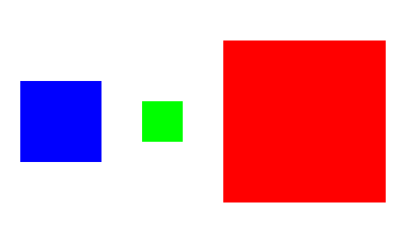

# Render

## Overview

CSS-style rendering support for Python.

## Example

```python
from render import Image, FixedContainer, RenderImage, Palette, JustifyContent, Alignment

if __name__ == "__main__":
    im1 = RenderImage.empty(100, 100, color=Palette.BLUE)
    im2 = RenderImage.empty(50, 50, color=Palette.GREEN)
    im3 = RenderImage.empty(200, 200, color=Palette.RED)
    el1, el2, el3 = map(Image.from_image, (im1, im2, im3))
    container = FixedContainer.from_children(
        width=500,
        height=300,
        children=[el1, el2, el3],
        alignment=Alignment.CENTER,
        justify_content=JustifyContent.SPACE_AROUND,
    )
    out_im = container.render()
    out_im.save("out.png")
```

This will generate [out.png](assets/out.png):


